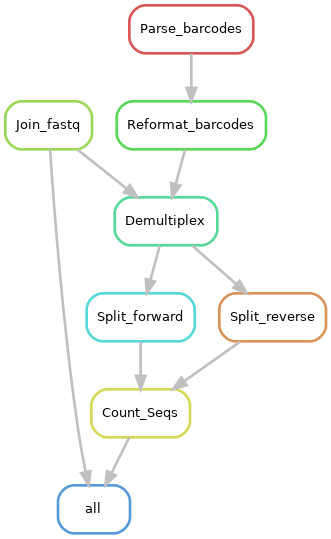

# Snakemake workflow: Demultiplex Fastq files
Given a set of index, fastq and sample to barcode file, generate a directory structure with each sample's forward and reverse reads contained in individual sample directories. 

 

## The pipeline requires the following programs

* usearch
* GNU parallel
* seqkit
* xlsx2csv
* snakemake

Please do not forget to cite the authors of the tools used.

## The pipeline does the following

1. Joins index fastq files (index1 and index2) using usearch -fastq_join

2. Either creates a 2-column samples to barcode file from an Excel File using xlsx2csv or uses a user supplied samples2barcode.tsv file

3. Converts the tab delimited samples2barcode.tsv file to a fasta file using awk

4. Uses Python to reformat barcodes. You might need to edit this step in the reformat_barcodes.py script to be specific for your barcodes

5. Demultiplexes the reads using usearch -fastx_demux

6. Splits the demultiplexed reads on a per sample basis with each sample's forward and reverse reads contained in sample specific directories. Uses GNU parallel for parallelization.

7. Counts and generates useful statistics on the demultiplexed reads using seqkit.

## Authors

* Olabiyi Obayomi (@olabiyi)

Before you start, make sure you have the programs listed above installed.

## Steps

### Step 1

Install the software list above.

### Step 2 

Obtain a copy of this workflow 

	git clone https://github.com/olabiyi/snakemake-Demultiplex-fastq.git

### Step 3

Replace the reads, index and sample2barcodes.tsv file with yours

### Step 4: Configure workflow

Configure the workflow according to your needs by editing the files in the `config.yaml` file

### Step 5:  Run the pipeline

	snakemake -pr --cores 10 --keep-going

Upon successful completion, your demultiplexed reads will be in a folder named **06.Split/** and statistics on them in a folder named **07.Count_Seqs/** 

